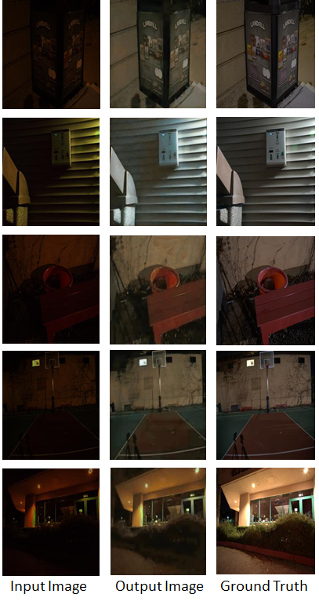
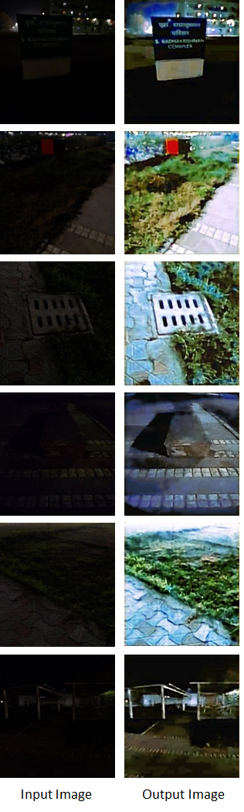

# DarkGAN: Night Image Enhancement using Generative Adversarial Networks

## [Link](https://link.springer.com/chapter/10.1007/978-981-16-1086-8_26) to view the research paper.

### The Research Paper pdf is also uploaded here.

## Abstract 

**Low light image enhancement** is one of the **challenging tasks** in **computer vision**, and
it becomes more difficult when images are very dark. Recently, most of the low-light image
enhancement work is done either on synthetic data or on the images which considerably
visible. **We propose** a **new method to enhance real-world night-time images**, which are
**dark** and **noisy**. **The proposed method consists of two pairs of Generator-Discriminator.**
Moreover, the **proposed method enhances dark shades and removes noise** up to a much
extent, with **natural-looking colors** in the **output image**. **Experimental results** evaluation
of the proposed method on the **”See In the Dark dataset” demonstrates the effectiveness of
the proposed model** compared with other **state-of-the-art methods**. The proposed method
yields comparable **better results** on **qualitative** and **quantitative** assessments when compared
with the existing methods.

## Publications

Prasen Alaspure, Praful Hambarde, Akshay Dudhane and Subrahmanyam
Murala, ”DarkGAN: Night Image Enhancement using Generative Adversarial
Networks”, International Conference on Computer Vision and Image
Processing (2020).
The Research Paper is published at Springer.

**[Link](https://link.springer.com/chapter/10.1007/978-981-16-1086-8_26) to view the research paper.**

***The Research Paper pdf is also uploaded here.**

## The following images show some results of our method on See In The Dark Dataset. 

## The images below shows the effectiveness of our method on images captured by mobile phone in our institute's campus.

